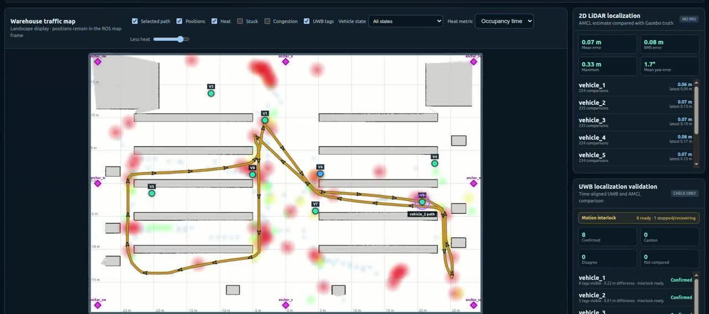

# ROS 2 Warehouse Traffic Monitor

ROS 2 Humble simulation for localizing warehouse vehicles with 2-D LiDAR,
recording their movement history, and displaying density, stuck-vehicle, and
congestion heatmaps in a browser.

## Demo

[](media/warehouse-traffic-demo.mp4)

Click the preview to watch the 73-second simulation demo showing the live
warehouse map, vehicle paths, localization metrics, UWB validation, traffic
heatmaps, and the Gazebo warehouse.

## Current simulation

- Gazebo Classic realistic 60 m x 40 m warehouse
- Up to eight independently localized traffic vehicles
- 2-D LiDAR and wheel odometry for every simulated vehicle
- AMCL localization against a map created with `slam_toolbox`
- Simulated UWB anchors for AMCL startup and continuous validation
- Random A* routes with static-obstacle and vehicle avoidance
- Context-aware motion states such as moving, turning, waiting, blocked, and
  stuck
- SQLite traffic history with wall-clock and simulation timestamps
- Vite dashboard with live monitoring, time-range queries, replay, selected
  vehicle paths, localization metrics, and traffic heatmaps

The UWB estimate is currently a checking and initialization source. AMCL remains
the recorded position source; this is not continuous LiDAR/UWB sensor fusion.

## Requirements

- Ubuntu 22.04
- ROS 2 Humble
- Gazebo Classic and `gazebo_ros`
- Nav2 AMCL and map server
- `slam_toolbox`
- Python 3 with Pillow and PyYAML
- Node.js/npm when rebuilding or developing the Vite frontend

Install missing ROS dependencies with `rosdep` from the workspace root:

```bash
rosdep install --from-paths src --ignore-src -r -y
```

## Build and run

```bash
git clone https://github.com/PakkaponBon/ros2-warehouse-traffic-monitor.git
cd ros2-warehouse-traffic-monitor
source /opt/ros/humble/setup.bash
colcon build --symlink-install
source install/setup.bash
ros2 launch my_first_bot real_warehouse.launch.py
```

The default launch starts eight vehicles at safe randomized positions, loads
the saved SLAM map, enables AMCL/UWB validation, records traffic, and serves the
dashboard at <http://127.0.0.1:8080>.

The read-only system-health page is available at
<http://127.0.0.1:8080/health.html>. It reports web/database availability,
recorder freshness, and the latest telemetry, localization, UWB, and LiDAR
diagnostic state for each configured vehicle. A vehicle is online when its
latest position is under five seconds old, stale from five through fifteen
seconds, and offline after fifteen seconds. Sensors without a dedicated
diagnostic heartbeat are shown as unknown rather than assumed healthy.

Useful overrides:

```bash
ros2 launch my_first_bot real_warehouse.launch.py \
  vehicle_count:=4 traffic_speed:=0.8 gui:=false
```

`vehicle_count` currently supports values from 1 to 8. Set `spawn_seed` to a
fixed integer for repeatable starting positions.

## Create a map with SLAM

The mapping profile uses one vehicle and feeds only its 2-D LiDAR and odometry
to `slam_toolbox`:

```bash
ros2 launch my_first_bot real_warehouse_slam.launch.py
```

After driving through the complete warehouse and closing loops, save the map:

```bash
ros2 run nav2_map_server map_saver_cli \
  -f src/my_first_bot/maps/real_warehouse_slam
ros2 run my_first_bot prepare_slam_map.py \
  src/my_first_bot/maps/real_warehouse_slam.yaml
```

The normal `real_warehouse.launch.py` profile uses this saved SLAM map by
default for AMCL, planning, and the web visualization.

## Web development

The production dashboard is served by `web_monitor.py`. For frontend hot
reload, keep the ROS monitor running and start Vite separately:

```bash
cd src/my_first_bot/web
npm install
npm run dev
```

Open <http://127.0.0.1:5173>. The Vite development proxy forwards API and map
requests to the monitor on port 8080.

Run frontend checks and produce a new production bundle with:

```bash
npm test
npm run build
```

## Reading the dashboard heatmap

Every map, path, metric, hotspot, and summary uses the time range selected at
the top of the dashboard:

- **Live now + Heat Trail** shows the most recent 5, 15, 30, or 60 minutes.
- **Jump to time** shows one Heat Trail window ending at the selected time. For
  example, jumping to 15:10 with a five-minute trail displays 15:05-15:10.
- **Custom range** accepts an exact start and end time for a historical query.

Heat colors are relative to the busiest cells in that selected range:

- light blue/cyan: very low activity
- green: low-to-medium activity
- yellow/orange: busy
- red: the highest activity

Red does not automatically mean a vehicle was stuck. Its meaning depends on
the selected **Heat metric**:

- **Occupancy time**: vehicles spent more time in the cell.
- **Unique vehicles**: more different vehicles visited the cell.
- **Slow time**: vehicles spent more time moving slowly or waiting there.

Point at a colored heat cell to inspect its coordinates, selected metric,
average speed, busiest time interval, vehicles present during that peak, and
confirmed stuck history. It separates normal vehicles from slow/problem
vehicles and shows states such as waiting, blocked, stalled, or stuck. The
hover interval automatically scales with the selected range; a one-hour heat
trail uses five-minute peak intervals.

Gray shapes are mapped shelves, walls, and fixed obstacles. `V1`-`V8` markers
are the latest positions in the selected range, and purple diamonds are fixed
UWB tags.

Use **Top hotspots** to inspect aggregated stuck and congestion locations. The
**Stuck by time** panel reports the busiest stuck location and distinct vehicle
count for each time bucket, for example `15:01 - x 4.5, y 2.0 - 3 vehicles`.
Short ranges use one-minute buckets; longer ranges automatically use larger
buckets. Clicking a row focuses that location on the main map. A row appears
only after a vehicle satisfies the configured stuck detector, which defaults
to 60 seconds of blocked or commanded-without-progress behavior.

## Traffic classification

Each vehicle publishes its operational context on:

```text
/traffic/vehicle_N/motion_state
```

Turning, planning, localization, sensor waiting, and intentional idle do not
create stuck events. Waiting behind another vehicle contributes to congestion.
A blocked or commanded-but-not-moving vehicle becomes stuck after the configured
duration, which defaults to 60 seconds.

The main recorder parameters include:

- `slow_speed`: speed threshold used by traffic classification
- `stuck_duration`: continuous blocked time before a stuck event
- `congestion_radius`: distance used to group nearby slow vehicles
- `congestion_min_vehicles`: minimum group size
- `congestion_duration`: time before a group becomes congestion

The database defaults to `~/.ros/real_warehouse_traffic.db`. Databases, ROS
bags, logs, build outputs, and Node dependencies are intentionally excluded from
Git.

## Main data flow

```text
LiDAR + odometry -> AMCL -> map-frame vehicle pose -> traffic recorder -> SQLite
                              ^                         |
                              |                         v
                       UWB validation              web monitor API
                                                        |
                                                        v
                                                Vite dashboard/replay
```

## Tests

```bash
source /opt/ros/humble/setup.bash
colcon test --packages-select my_first_bot --event-handlers console_direct+
colcon test-result --verbose
```

## Scope

This repository is a simulation and analytics prototype. The random route
planner is used to generate warehouse traffic; it is not intended to control a
real forklift. A real deployment still needs calibrated sensors, a fleet data
adapter, dedicated hardware heartbeats, network security, enforced database
retention, and site-specific safety validation.

## Licensing and assets

The ROS package declares Apache-2.0 for its original code. Third-party Gazebo
assets retain their own terms; see [THIRD_PARTY_NOTICES.md](THIRD_PARTY_NOTICES.md).
The legacy MOV.AI warehouse asset must be reviewed or replaced before changing
this repository from private to public.
