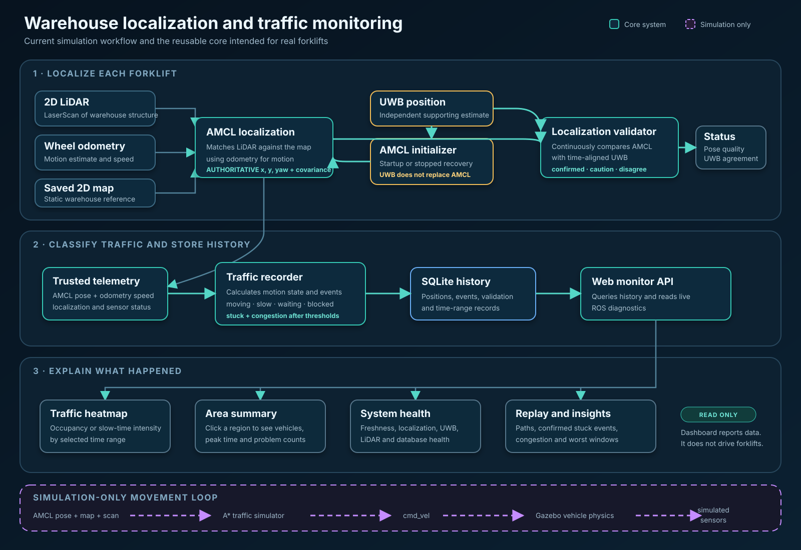

# System workflow

## Purpose and status

This document defines the intended end-to-end workflow for a fleet of up to 19
warehouse forklifts. It connects the working ROS 2 simulation to a future real
deployment without treating simulation-only motion control as production
forklift software.

The following functions already exist in simulation:

- 2-D LiDAR and odometry input
- AMCL localization in a shared `map` frame
- UWB-assisted AMCL startup and stopped-vehicle recovery
- continuous AMCL/UWB agreement diagnostics
- operational motion-state classification
- one-second traffic sampling into SQLite
- stuck and congestion detection
- historical queries, replay, heatmaps, and localization metrics

The edge uploader, central ingestion service, production database, device
identity, and fleet health service described below are design targets. They are
not implemented yet.

## Visual workflow



Solid teal paths show the reusable localization, recording, and monitoring
logic. The purple dashed lane is simulation-only: it moves the virtual vehicles
and is not part of the read-only production monitoring workflow.

## Safety boundary

This project is a localization and traffic-observation system. It must not
become part of the forklift's safety control loop without a separate certified
safety design.

- The existing UWB proximity/speed-reduction system remains independent.
- Internet or server loss must not stop local safety functions.
- The cloud and dashboard must not send motion commands in the first real-world
  version.
- A missing or untrusted localization result must be reported as unavailable;
  it must not be replaced silently with an old or invented pose.

## System participants

| Participant | Responsibility | Status |
|---|---|---|
| 2-D LiDAR driver | Publish planar scans | Simulated |
| Odometry source | Publish local vehicle motion | Simulated |
| AMCL | Estimate forklift pose in `map` | Implemented |
| UWB adapter | Convert the existing UWB result into a map-frame check | Simulated |
| Localization validator | Compare time-aligned AMCL and UWB positions | Implemented |
| Motion-state adapter | Report moving, waiting, blocked, idle, and related context | Implemented for simulation |
| Traffic recorder | Produce samples and traffic events | Implemented with SQLite |
| Edge outbox/uploader | Buffer and upload acknowledged batches | Not implemented |
| Central ingestion API | Authenticate devices and validate batches | Not implemented |
| Central database | Retain fleet history and aggregates | Not implemented |
| Route recommendation service | Produce traffic-aware advisory paths | Not implemented |
| Web application | Show live and historical fleet information | Implemented against the local API |

## End-to-end data flow

```text
LOCAL FORKLIFT

2-D LiDAR ------+
                +--> AMCL --> authoritative map pose ----+
Odometry -------+                                        |
                                                         +--> traffic sample
UWB ranges/fix --> UWB adapter --> validation only ------+        |
                                                                  v
Motion intent/context --------------------------------------> edge outbox
                                                                  |
                                                         outbound encrypted
                                                              batch upload
                                                                  |
                                                                  v
CENTRAL SYSTEM

ingestion API --> validation/deduplication --> central database
                                                   |
                          +------------------------+-------------------+
                          v                        v                   v
                      live state             aggregation       incident events
                          +------------------------+-------------------+
                                                   |
                                                   v
                                           web dashboard/API
```

## Commissioning workflow

Commissioning is performed once per site and once per forklift.

### Site commissioning

1. Create the warehouse map with SLAM or import a surveyed occupancy map.
2. Assign a unique `map_id` and immutable `map_version`.
3. Define the `map` origin, orientation, resolution, and site coordinate
   convention.
4. Survey any UWB reference coordinates into the same `map` frame.
5. Record restricted zones and areas excluded from analytics.
6. Validate the map by revisiting known points and measuring localization
   error.
7. Publish the approved map package and its checksum to the fleet.

### Forklift commissioning

1. Assign a permanent `vehicle_id`, for example `forklift_01`.
2. Install the edge computer, 2-D LiDAR, storage, and network connection.
3. Measure the LiDAR-to-base transform and record the calibration version.
4. Connect odometry without changing the existing safety controller.
5. Provision the device certificate and server trust chain.
6. Install the approved map and UWB survey configuration.
7. Verify timestamps, topic rates, LiDAR visibility, AMCL accuracy, UWB
   agreement, local buffering, and upload acknowledgement.
8. Store a signed commissioning report.

## Forklift startup workflow

```text
BOOT
  |
  v
SELF_TEST -- hardware/storage failure --> FAULT
  |
  v
TIME_SYNC -- unavailable -------------> DEGRADED_TIME
  |
  v
LOAD APPROVED MAP + CALIBRATION -- invalid --> FAULT
  |
  v
START LIDAR + ODOMETRY -- missing -----> SENSOR_WAIT
  |
  v
REQUEST UWB FIX -- insufficient tags --> LIDAR_LOCALIZING
  | valid x/y
  v
INITIALIZE AMCL x/y; LIDAR RESOLVES YAW
  |
  v
LOCALIZATION STABLE? -- no -----------> LOCALIZING / ALERT
  |
  v
READY --> record locally --> connect/upload when network is available
```

UWB availability should improve startup confidence, but loss of UWB must not
automatically invalidate a stable LiDAR/odometry localization result. Likewise,
a large AMCL/UWB disagreement must produce a diagnostic and human-visible alert,
not an uncontrolled AMCL reset.

## Normal runtime workflow

Every traffic sampling period, currently one second:

1. Read the newest trustworthy AMCL pose.
2. Verify that pose age and covariance are within configured limits.
3. Read speed, commanded motion/intent, and operational state.
4. Attach UWB validation state when a time-aligned fix exists.
5. Write the sample transactionally to the local outbox database.
6. Run stuck and congestion classification independently of upload status.
7. Add a monotonically increasing sequence number within the current boot
   session.
8. Upload a batch when the network is available.
9. Delete or archive local acknowledged rows only according to the approved
   retention policy.

## Minimum telemetry record

The future transport record should contain at least:

```json
{
  "schema_version": 1,
  "site_id": "warehouse_a",
  "vehicle_id": "forklift_01",
  "boot_id": "uuid",
  "sequence": 12345,
  "observed_at": "2026-09-02T08:15:30.123Z",
  "monotonic_ms": 482501,
  "map_id": "warehouse_a_map",
  "map_version": "sha256:...",
  "x": 12.34,
  "y": -4.56,
  "yaw": 1.57,
  "speed_mps": 0.42,
  "motion_state": "moving",
  "pose_source": "amcl",
  "localization_status": "valid",
  "uwb_validation": "confirmed"
}
```

`boot_id` plus `sequence` forms an idempotency key so a retried batch does not
create duplicate history.

## Route suggestion workflow

Route suggestions are a separate analytics feature. They must not be drawn
inside the historical traffic-map block because that map answers a different
question: where traffic and incidents happened during a selected time range.

The dashboard instead provides a dedicated **Route suggestions** block:

```text
+------------------------------------------------------------------+
| Route suggestions                                                |
| Vehicle: [forklift_07]  From: [current pose]  To: [Station B]    |
| Traffic profile: [current + similar historical time] [Suggest]   |
|                                                                  |
| Recommended route       Alternative route       Route mini-map   |
| 184 m / 4m 10s          171 m / 5m 05s          [own display]    |
| Medium traffic          High traffic                              |
| Avoids: aisle C congestion, loading-area queue                   |
+------------------------------------------------------------------+
```

The route mini-map is owned by this block and is independent from the traffic
heatmap. Selecting or clearing a recommendation must not change the historical
map's layers, time selection, or vehicle-path selection.

### Inputs

- selected `vehicle_id` and its newest trustworthy map pose;
- destination selected from an approved station list or free map point;
- approved occupancy-map version and forklift footprint/clearance;
- current closed/restricted zones;
- current vehicle positions and trustworthy motion states;
- historical density, slow-time, stuck, and congestion aggregates for a
  comparable day/time window; and
- freshness/confidence limits for every dynamic input.

### Planning method

1. Inflate occupied map cells by the selected forklift's footprint and safety
   clearance.
2. Build a traversable grid or aisle graph from the approved map.
3. Find the normal shortest safe path as a baseline.
4. Add configurable penalties for historical delay, repeated stuck events,
   congestion, narrow clearance, current blockages, and stale information.
5. Find the lowest-cost traffic-aware path and at least one useful alternative.
6. Reject any route that crosses occupied, restricted, or insufficient-clearance
   cells.
7. Return the path together with distance, estimated travel time, risk score,
   data freshness, and plain-language reasons for the recommendation.

A conceptual cost function is:

```text
route cost = distance
           + historical traffic penalty
           + stuck/congestion penalty
           + live blockage penalty
           + clearance penalty
```

The weights must be configuration values and later calibrated from recorded
travel times. The shortest geometric route is not always the fastest route.

### Advisory boundary

- The first version suggests a route to a dispatcher/operator only.
- It does not publish `cmd_vel`, a Nav2 goal, or a command to a real forklift.
- Every result states its map version and generation time.
- If localization, map, or traffic data is stale/untrusted, the block shows
  **Recommendation unavailable** instead of inventing a path.
- The operator can compare the recommended and baseline routes and record
  whether the suggestion was accepted.

The first implementation optimizes one selected forklift at a time. Coordinated
optimization of all 19 moving forklifts requires route reservations and
time-aware conflict resolution; that is a later fleet-management phase.

## Degraded operation

| Condition | Required behavior |
|---|---|
| Internet unavailable | Continue local localization, safety, classification, and buffering |
| Central server unavailable | Retry with bounded exponential backoff; do not block ROS callbacks |
| UWB unavailable | Continue AMCL when trustworthy; report UWB unavailable |
| AMCL uncertain/lost | Mark pose invalid or degraded and alert; do not publish it as confirmed traffic history |
| LiDAR unavailable | Enter `sensor_wait`, stop producing trusted map poses, and alert |
| Odometry unavailable | Mark localization degraded and follow the approved local operating policy |
| Local disk nearly full | Raise an alert and apply the documented outbox retention priority |
| Clock unsynchronized | Preserve monotonic order and flag wall-clock timestamps as untrusted |

## Shutdown and maintenance

On a planned shutdown, the edge service should stop accepting new samples,
commit the current transaction, attempt a bounded final upload, checkpoint the
database, and record the shutdown reason. It must not delay the forklift's
safety shutdown.

Maintenance changes to maps, calibration, certificates, thresholds, or software
must be versioned and auditable. A rollback package must remain available until
the new version passes acceptance checks.

## Acceptance criteria before a real pilot

- A forklift is uniquely identifiable after reinstall and reboot.
- The approved map and calibration versions are visible centrally.
- Localization accuracy is measured at representative warehouse locations.
- A one-hour network outage loses no locally committed data.
- Replayed batches create no duplicate samples.
- Safety operation continues while the server and dashboard are stopped.
- Sensor loss and localization disagreement appear as explicit states.
- A database backup can be restored and queried.
- Users can view data only for their authorized site and role.
- Every suggested route stays inside traversable clearance and reports the map
  version, input freshness, cost explanation, and safe alternative.
- Route suggestions remain advisory and cannot command a forklift.
